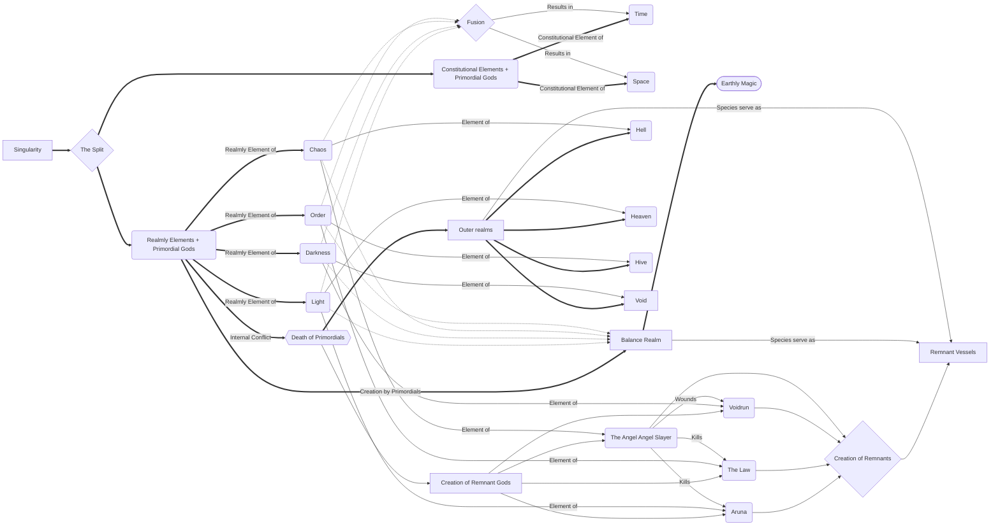

---
tags:
  - realmsadventure
---

```mermaid
flowchart LR

    S[Singularity] ==> TS{The Split}

    TS ==> RE(Realmly Elements + Primordial Gods)

    TS ==> CE(Constitutional Elements + Primordial Gods)

    RE ==Realmly Element of==> LE(Light)

    RE ==Realmly Element of==> DE(Darkness)

    RE ==Realmly Element of==> CHE(Chaos)

    RE ==Realmly Element of==> OE(Order)

    CE ==Constitutional Element of==> TE(Time)

    CE ==Constitutional Element of==> SE(Space)

    LE -.-> FE{Fusion}

    DE -.-> FE

    CHE -.-> FE

    OE -.-> FE

    FE --Results in--> TE

    FE --Results in--> SE

    RE ==Creation by Primordials===> BR[Balance Realm]

    RE ==Internal Conflict==> DeP{{Death of Primordials}}

    DeP ==> OR[Outer realms]

    LE -..-> BR

    DE -..-> BR

    CHE -..-> BR

    OE -..-> BR    

    BR ==> EE([Earthly Magic])

    OR ==> Hell(Hell)

    OR ==> Heav(Heaven)

    OR ==> Hive(Hive)

    OR ==> Void

    CHE --Element of---> Hell

    LE --Element of---> Heav

    OE --Element of---> Hive

    DE --Element of--> Void

    DeP --> CrR[Creation of Remnant Gods]

    CrR --> Aru(Aruna)

    CrR --> Voi(Voidrun)

    CrR --> Law(The Law)

    CrR --> Ang(The Angel Angel Slayer)  

    CHE --Element of---> Ang

    LE --Element of---> Aru

    OE --Element of---> Law

    DE --Element of---> Voi

    Ang --Kills--> Aru

    Ang --Kills--> Law

    Ang --Wounds--> Voi

    Aru --> CR{Creation of Remnants}

    Law --> CR{Creation of Remnants}

    Voi --> CR{Creation of Remnants}

    Ang --> CR{Creation of Remnants}

    CR --> RV[Remnant Vessels]

    BR --Species serve as--> RV

    OR --Species serve as--> RV
```